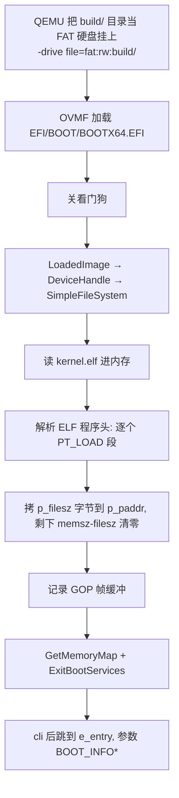

# 最小 UEFI 引导程序

x86_64 的 UEFI 引导程序，零外部依赖（不需要 gnu-efi / EDK2）。
它从 ESP 读出 `kernel.elf`，按 ELF 程序头把各个 PT_LOAD 段装载到各自的
物理地址（`.bss` 按 `p_memsz` 清零），退出 Boot Services 后跳到 `e_entry`。

## 构建与运行

```sh
make            # 生成 build/EFI/BOOT/BOOTX64.EFI 和 build/kernel.elf
make run        # QEMU + OVMF 启动（图形窗口 + 终端串口输出）
make run-nox    # 无头运行（服务器 / SSH 下用）
make test       # 在开发机上测试 printf 的格式化逻辑（不用开虚拟机）
make DEBUG=1    # 调试构建（-Og -g3，产物在 build/debug/），供 VS Code F5 使用
make run-gdb    # 启动 QEMU 并停住等 GDB（手动调试用，配合 launch.json）
make debug-stop # 收掉残留的调试用 QEMU
make esp        # 另外产出一个独立 FAT 镜像 dist/esp.img（真机 / 拷贝用）
make clean
```

## 构建目录就是虚拟磁盘

`build/` 目录**本身就是启动盘**：QEMU 用 vvfat 把宿主机目录实时映射成一块
FAT 硬盘挂给客户机，没有 dd / mformat / mcopy 这类打包步骤，产物放对位置就能启动。

```
build/                      ← 这块目录 = 一块 FAT 硬盘
├── EFI/BOOT/BOOTX64.EFI    ← UEFI 固件固定查找的启动文件路径
├── kernel.elf              ← 引导程序读的文件
└── *.o                     ← 中间产物，也会出现在盘上（无妨碍）
```

对应 QEMU 参数就是一个 `-drive`：

```sh
-drive format=raw,file=fat:rw:build/
```

这么做的好处：

- **没有打包步骤**。改完 `make` 直接启动，不用重新生成镜像文件。
- **往启动盘里加文件就是往 `build/` 里放文件**。比如以后要加内核模块、配置文件、
  测试数据，丢进 `build/` 就行，下一轮启动就生效。
- **调试构建自成一个盘**。`make DEBUG=1` 时 `BUILD=build/debug`，天然和默认构建互不干扰。

### 客户机能写这块盘（双向，实时）

这块盘是**可读可写**的，而且客户机的写入是**立刻**落到宿主机目录上的——不是退出时才同步。
实测（用一个 UEFI 小程序在客户机里建文件、改已有文件）：

| 操作 | 结果 |
| --- | --- |
| 客户机新建 `\WRITETEST.TXT` 并写入 | 宿主机 `build/WRITETEST.TXT` **立刻出现**，内容一致 |
| 客户机改写已有的 `\kernel.elf` 前 4 字节 | 宿主机 `build/kernel.elf` 的 md5 **立刻变化** |
| 反复读取 | 客户机自己也能读回刚写的内容（`Flush` 后立即可见） |

也就是说这块盘就是 `build/` 目录本身，**没有写保护**，可以作为持久化存储用：
内核可以把数据写进去，宿主机上直接就能看到；重启虚拟机后数据还在。

代价是同一枚硬币的另一面：客户机里的程序（包括还在开发中的内核）**有能力破坏
构建产物**，比如把 `build/kernel.elf` 写坏。真在客户机里做写盘实验时，建议复制一份
目录当磁盘（`cp -r build /tmp/disk && -drive file=fat:rw:/tmp/disk/`），
别拿正在用的 `build/` 冒险。

两个注意点：

- vvfat **必须用 `rw`**。只读模式（`fat:ro:` 或给磁盘加 `,readonly=on`）QEMU 会直接报
  `Block node is read-only` 起不来 —— 也就是说这个方案**没法只读挂载**。
- **方向性不一样**：客户机 → 宿主机的写入是实时的（上面已实测）；反方向，
  客户机看到的是启动时扫描出来的目录结构，所以 **QEMU 运行时不要在宿主机上改
  `build/` 里的东西**（QEMU 官方也明确警告过这点）。
  反过来说，改完文件**重新启动**就一定会被看到 —— 错误处理测试就是这么做的。

需要一块真正的磁盘镜像时（烧到 U 盘 / 挂给别的虚拟机）用 `make esp`，产物在
`dist/esp.img`（单独放，否则镜像会变成磁盘里的一个文件）。

## 文件

| 文件 | 说明 |
| --- | --- |
| `boot/efi.h` | 自包含的最小 UEFI 定义（类型、GUID、Boot Services、文件协议、GOP） |
| `boot/elf.h` | 装载 ELF64 需要的定义（文件头、程序头、PT_LOAD） |
| `boot/boot.c` | 引导程序：解析 ELF 并装载各段、取内存映射、`ExitBootServices`、跳转 |
| `boot/bootinfo.h` | 引导程序与内核共享的 `BOOT_INFO`、内存描述符与类型常量 |
| `kernel.lds` | 内核链接脚本：段落地址、`PHDRS` 段划分、`.bss` 边界符号 |
| `init/main.c` | 内核入口：初始化串口、打印启动信息与内存映射统计 |
| `drivers/serial.c` | 16550 串口驱动（COM1，轮询方式） |
| `lib/printf.c` | printf 实现（`printf`/`snprintf`/`kvprintf`） |
| `tests/printf_test.c` | printf 的主机端测试，65 项断言 |
| `tools/qemu-debug.sh` | F5 用的启动脚本：起 QEMU 并等 gdbstub 真正可连接 |
| `.vscode/launch.json` | cppdbg 调试配置 |
| `.vscode/tasks.json` | 构建 / 启动 QEMU / 收尾三个任务 |
| `dist/esp.img` | `make esp` 产出的独立镜像（不进版本库，`make clean` 会删） |

## 在 VS Code 里调试（F5）

直接按 F5 就会：构建调试版内核 → 后台启动 QEMU（`-S` 把 CPU 停在复位向量等 GDB）
→ 连接 gdbstub → 在内核入口下硬件断点 → 固件启动 → 停在下图的 `kernel_main`。

不用 VS Code 时，手动调试：先 `make run-gdb`，然后另开终端执行
`gdb build/debug/kernel.elf -ex 'target remote :1234'`。

### 预启动任务不能挂 dependsOn（F5 “没反应”的根因）

`preLaunchTask` 指向的“内核：启动 QEMU 并等待 GDB”是个**后台任务**，它的就绪判断
靠 `problemMatcher.background` 的 `beginsPattern`/`endsPattern`。

一旦给它加 `dependsOn`（哪怕只是挂个构建任务），VS Code 的就绪检测就会失灵：
QEMU **会被正常拉起来**（说明 preLaunchTask 确实执行了），但 VS Code 永远等不到
“任务就绪”，于是**调试器一个进程都不会启动**，界面上看起来就是“按了 F5 没反应”。
实测加回去 100% 复现，去掉就正常。

所以构建不由任务依赖完成，而是让脚本自己负责（`tools/qemu-debug.sh` 里的
`make -s DEBUG=1 all`）——这样既没有依赖，又保证每次都是新产物。

改完 `.vscode/tasks.json` 记得**重载窗口**（`Developer: Reload Window`）：
任务定义是启动时加载的，不重载的话改动不生效，看起来就像“改了也没用”。

### 串口输出有文件备份

QEMU 的串口既显示在任务终端里，也会写一份到 `$(BUILD)/serial.log`
（见 Makefile 的 `QEMU_SERIAL`），用 `-chardev stdio,id=vser,logfile=...` 实现。

这个文件在调试时特别有用：**看它停在哪里就能判断断点中没中**。
比如正常停在内核入口时，日志会在引导程序的最后一行截断、看不到任何 `[kernel]` 输出；
继续执行后 `[kernel]` 输出才会紧跟着出现。不用盯着屏幕也能确认。

### 几个必须知道的点（都是实测踩出来的）

1. **`stopAtEntry: true` 不能删。** 内核入口那一停会被 MIEngine 归类为“入口点
   (entry point)”，而 cpptools 默认会静默越过入口点，界面根本不会停。实测删掉后
   再也停不进内核。
2. **`stopAtConnect: false` 不能改。** 连接 gdbstub 时 QEMU 必然要停一下（GDB 才能
   接管目标），引擎需要把这次“没有 reason 的停顿”当成 gdbserver 连接噪声放行——
   这也是整条链路里**唯一**的一次 continue。改成 `true` 会多出一次 continue，
   实测它会被 GDB 排队、随后把入口断点冲掉（表现为停在复位向量、内核直接跑飞）。
3. **入口断点必须是硬件断点**（`-break-insert -h`），而且要用**符号名**不要写地址。
   GDB 连过来时内核还没被引导程序读进内存，软件断点写下的 `0xCC` 会被随后加载
   内核的写入覆盖掉，永远不命中；而入口地址也不是固定的（实测发布版 `kernel_main`
   在 `0x100000`、调试版在 `0x100223`，跟优化级别/函数排放有关），交给 GDB 从符号表解析。
4. **F5 之前就打的断点不会生效**（原因同第 3 条：它们在连接前就被插入，随即被覆盖）。
   补救办法：停到 `kernel_main` 之后，把那个断点在编辑器里**关掉再打开**
   （等价于 `-exec disable` / `-exec enable`，会重新写入断点）。
   所以推荐的工作流是：**先 F5 停到内核入口，再下断点**。
5. 硬件断点只有 4 个（x86 的 DR0-DR3），入口那个占了 1 个。
6. 调试构建与默认构建产物分开放（`build/debug/` 与 `build/`），切换优化级别不需要
   `make clean`。因为构建目录就是磁盘，这两者自然也就是两块独立的盘。

### tasks.json 里自定义 problemMatcher 的坑

F5 用的 preLaunchTask 是**后台任务**，必须靠自定义 `problemMatcher` 的 `background`
来告诉 VS Code"什么时候算就绪"。而自定义 `problemMatcher` 会被 VS Code 严格校验，
规则藏在 `src/vs/workbench/contrib/tasks/common/problemMatcher.ts` 里，报错信息又很含糊：

| 写法 | VS Code 的反应 |
| --- | --- |
| pattern 只有 `message`，没有 `file` | “问题模式无效。必须至少包含一个文件和一条消息。”（`missingProperty`） |
| pattern 有 `file`+`message` 但没声明 `kind` | 又报“它必须为"file"，代码行或消息匹配组其中的一项。”（`missingLocation`，因为 `kind` 缺省按 `location` 处理，此时必须再有 `line`/`location`） |
| `"fileLocation": ["absolute", "…"]` | “说明无法转换为问题匹配器。”（`noProblemMatcher`——两元素数组只接受 `relative`/`autoDetect`） |

现在这份配置的写法：显式 `"kind": "file"` + `"fileLocation": "absolute"`，
pattern 只用来匹配 `tools/qemu-debug.sh` 自己的诊断行（`[qemu] <脚本路径>: error: <原因>`），
所以真的启动失败时"问题"面板里会出现一条指向脚本的可点击错误，
而正常输出（`[qemu] starting…` / `gdbstub listening…`）不会刷屏。

改完想确认没写坏，可以看任务输出通道的日志
（`~/.config/Code/logs/*/window*/output_*/tasks.log`）：**配置非法会在这里追加错误块，
合法则什么都不写**。

## printf

`lib/printf.c` 不依赖任何库，格式化过程只调用一个 `putc_fn` 回调，
所以串口输出和写缓冲区共用同一套代码：

- `printf` / `vprintf` / `putchar` / `puts` → `drivers/serial.c` 的 COM1
- `snprintf` / `vsnprintf` → 写缓冲区，语义同 C99（返回“本该写入”的长度）
- `kvprintf(putc_fn out, void *ctx, const char *fmt, va_list ap)` → 核心，可接到任意输出端

支持的转换：`%d %i %u %x %X %o %p %c %s %%`；
标志：`-` `0` `+` 空格 `#`；宽度/精度支持数字和 `*`；长度修饰支持 `hh h l ll z j t`。
不支持浮点（`%f`）。为了写错时能发现，不认识的转换字符会原样输出。

`printf.h` 给这些函数加了 `__attribute__((format(printf, ...)))`，
编译时会用 `-Wformat` 检查格式串和参数是否匹配。

> 注意：`%p` 固定输出 16 位十六进制（`0x0000000000001234`），空指针输出全 0，
> 不打印 `(nil)`。

## 工作流程



## ELF 装载

相比读扁平二进制（`objcopy -O binary`），按 ELF 装载多做了两件事：

| | 扁平二进制 | ELF |
| --- | --- | --- |
| 装载到哪 | 两边硬编码同一个常量 | 程序头的 `p_paddr` 说了算 |
| `.bss` | 不在文件里，内核得自己清 | `p_memsz > p_filesz` 的部分由装载器清零 |
| 段权限 | 无法表达 | `p_flags` 给出 R/W/X |
| 入口 | 约定“文件第一个字节” | `e_entry` |

几个实现要点：

- **一次占完整段地址空间**。所有 PT_LOAD 段覆盖的 `[p_paddr, p_paddr+p_memsz)` 先扫一遍求出总跨度，
  再用一次 `AllocatePages(AllocateAddress)` 占下来。若逐段申请，两段可能各自成功却互相重叠。
- **装载前先把内存填成 `0xAA`**。这样内核里 `.bss` 读到 0 就能确定是装载器
  （按 `p_memsz - p_filesz`）清出来的，而不是“内存凑巧本来就是 0”。
  内核的 `verify_elf_load()` 会检查这件事并打印结果。
- **`p_offset` 和 `p_vaddr` 必须同余**（这是 ELF 的硬性要求）。链接脚本没有用 `AT()`，
  所以 `p_paddr == p_vaddr`；`-z max-page-size=0x1000` 避免段落被 2MB 对齐、白空一大块。
- **段是由链接脚本的 `PHDRS` 决定的**。不写 `PHDRS` 时链接器会把
  `.text/.rodata/.data/.bss` 全塞进一个 `RWE` 段（能跑，但段权限失去意义）；
  显式声明后会得到 `R E` + `RW` 两个 PT_LOAD，`.bss` 落在后者的 `memsz - filesz` 里。
- 引导程序只认识 `PT_LOAD`，其它（如 `GNU_STACK`）一律跳过。
- **装载前会校验 ELF**：魔数、64 位小端、`ET_EXEC` + `EM_X86_64`、程序头表落在文件内、
  每段 `p_filesz <= p_memsz` 且 `p_offset + p_filesz` 不越界。任何一条不满足都会打印
  `[BOOT] ERROR: ...` 交还固件，而不是跑飞（实测破坏魔数、截断文件、改位数、
  把 `e_phoff` 指到文件外四种情况都能给出明确报错）。

- **ABI**：UEFI 在 x86_64 上用微软 x64 调用约定，所以引导程序用
  `clang --target=x86_64-unknown-windows` 编译；而内核是 System V 约定，
  因此 `boot.c` 里的内核入口指针显式标了 `__attribute__((sysv_abi))`。
  漏掉这一条会导致内核收到的参数在 `rcx` 而不是 `rdi`，一进入内核就 #GP。
- **没有 gnu-efi**：本机 binutils 的 `objcopy` 不支持 `efi-app-x86_64` 目标，
  所以直接用 clang 生成 COFF + `lld-link /subsystem:efi_application`。
- **装载地址**：由 `kernel.lds` 决定（Makefile 的 `KERNEL_LOAD_ADDR` 通过
  `--defsym=_kernel_load_addr=...` 传进去，默认 `0x100000`）。引导程序不再需要
  这个常量：它按程序头里的 `p_paddr` 装载、按 `e_entry` 跳转。
  那段物理内存必须是空闲的，否则 `AllocatePages(AllocateAddress)` 会报错。
- **退出 Boot Services 之后**：`ConOut`、`AllocatePool` 等全部失效，
  所以所有打印都在退出前完成。UEFI 的恒等映射页表仍然有效，内核只能
  访问恒等映射的物理地址。
- **控制台字符集**：引导程序的输出全部是 ASCII，因为 OVMF 的 GOP 控制台
  字体没有中文字形（代码注释里用中文没问题）。
- **内存映射的步长**：规范里的 `EFI_MEMORY_DESCRIPTOR` 是 40 字节，但固件
  返回的 `DescriptorSize` 可能更大（OVMF 是 48，多出的 8 字节在末尾）。
  遍历必须按 `GetMemoryMap` 给出的步长走，不能当结构体数组直接索引；
  `boot.c` 里的 `_Static_assert` 只保证字段布局和 `BOOT_MEMORY_DESCRIPTOR` 一致。
